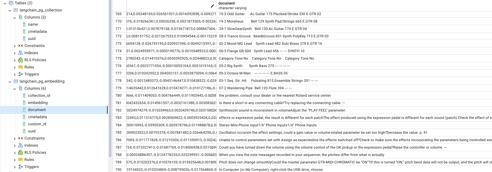
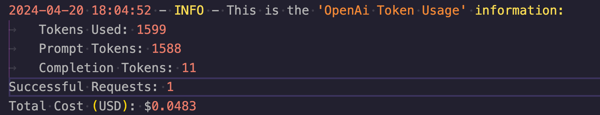
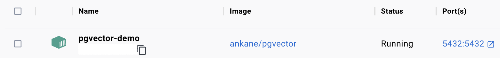

# Music Pdf Chat

A PDF Chatbot Application for reading Music Equipment Instruction Manuals :robot:
- - - -

## Application

This Python Retrieval-Augmented Generation (RAG) application is able to read multiple PDFs - up to 200MB at a time - and answer questions inputed into the 'input question' box.
It was designed as a 'Proof Of Concept' to be ran in a local machine, with a focus on open-source tools. Application stack:

* **Streamlit** - Front End
* **OpenAi** - LLM
* **Langchain** - Orchestration
* **PyPDF2** - PDF text extraction
* **PyTesseract** - OCR on AES Encrypted PDFs or PDFs with images in the background that would result in an empty text extraction
* **PostgreSQL** with the `pgvector` extension - Vector Database
  


- - - -

## Features

* A Langchain `callback` function that calculates 'OpenAi' token usage and prints it to a logger file. 

* A `script execution time` functionality printed to a logger file for future Cloud Development considerations.
* A secure API/TOKEN keys connection hidden in the `.env` file
* Capability to answer questions based on documents that are already vectorized and stored in the database - no need to reupload the same PDFs.
* Ability to extract text from AES locked PDFs or PDFs with background images that block a simple text extraction.
* A 'Clear Chat History' button.

- - - -

### Future Improvements

* Create a 'Web URL Input' functionality, so that the user has the option to either upload a file or add a PDF web url.
* Create a 'document uploaded' metadata JSON file that will be sent into a NoSQL database so that there is a record of all the PDFs previously vectorized, so that the user can view a list of these PDFs and ask questions about them.
* Create a drop down box in the UI, so that the user can view these available PDF file names.
* Cloud Native Deployment on AWS and GCP.
  
- - - -

#### Instructions

* Install the [tesseract cli](https://tesseract-ocr.github.io/tessdoc/Command-Line-Usage.html) in your local machine and add the `tesseract location path` to the `.env` file - `pytesseract` is a python package for `tesseract`, however, it works out of the tesseract cli locally installed.

* Build a PostgreSQL `pgvector` local connection set up:
Pull the `pgvector` [Docker image](https://hub.docker.com/r/ankane/pgvector), [enable the pgvector extension](https://github.com/pgvector/pgvector) on the PostgreSQL database, and run the Docker container locally with this command:

```
docker run --name pgvector-demo -e POSTGRES_PASSWORD=<your_database_connection_password> -p 5432:5432 -d ankane/pgvector
```



* Add the `OpenAI`, `PGVector` and `tesseract` connection tokens in the `.env` file

* Create a python virtual environment
* Activate local `virtual environment` on terminal:

    `source roland_venv/bin/activate`

* Install the required packages
* **Note**: Because Langchain APIs are constantly being updated, it's important to use the exact package versions listed below :arrow_down:, otherwise this application might encounter errors in its functionality

* Start the `streamlit` application on terminal:

    `streamlit run roland-app.py`


##### Required Packages

```
InstructorEmbedding       1.0.1
langchain                 0.1.16
langchain-community       0.0.32
langchain-core            0.1.42
langchain-openai          0.0.6
langchain-text-splitters  0.0.1
langsmith                 0.1.47
openai                    1.12.0
pdf2image                 1.17.0
pgvector                  0.2.5
SQLAlchemy                2.0.27
streamlit                 1.33.0
PyPDF2                    3.0.1
pytesseract               0.3.10
python-dotenv             1.0.1
tiktoken                  0.6.0
tokenizers                0.15.2
```
